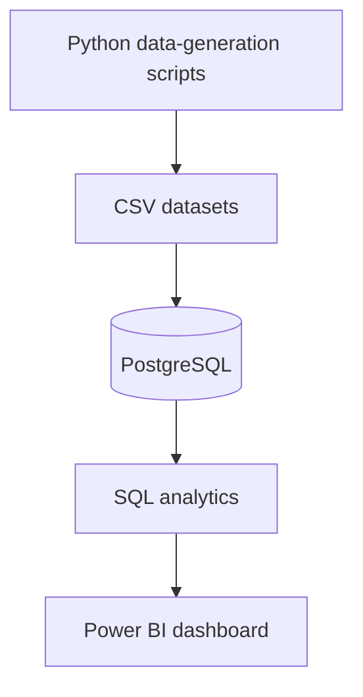
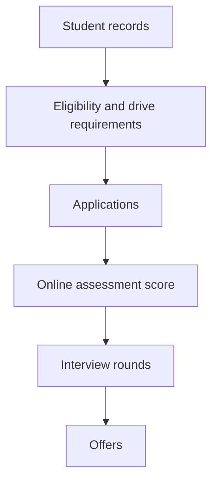
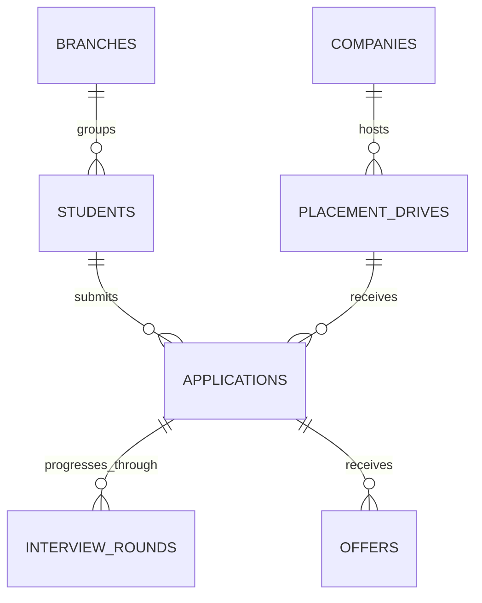

# Placement Analytics Dashboard

[](https://www.python.org/)
[](https://www.postgresql.org/)
[](https://www.postgresql.org/)
[](https://powerbi.microsoft.com/)

An end-to-end placement analytics project built with Python, PostgreSQL, SQL, and Power BI. It generates synthetic university recruitment data, loads related records into a relational database, and presents placement KPIs in an interactive dashboard.

## Dashboard Screenshots

> Interactive Executive Dashboard
> 

With respect to EE branch (interactive dashboard)


## Key Findings

Computed from the CSV files checked into `data/`. Placement rate counts distinct students with at least one offer; application conversion counts distinct applications with an offer.

| Metric | Result |
|---|---:|
| Student-level placement rate | 2,510 / 5,000 students — **50.20%** |
| Application conversion rate | 11,419 / 36,297 applications — **31.46%** |
| Funnel: applications | 36,297 |
| Funnel: assessment cleared (`oa_score >= 70`) | 18,939 |
| Funnel: reached interview (distinct application IDs in `interview_rounds`) | 11,419 |
| Funnel: received offer (distinct application IDs in `offers`) | 11,419 |
| Largest funnel drop | Applications → assessment cleared: 17,358 applications (**47.82%** of applications) |
| Branch with most offers | Branch ID **3**: 2,460 offers; **20.56%** of students (1,028 / 5,000) |
| Top 10 companies' share of offers | 5,565 / 11,419 — **48.73%** |
| Average offered CTC | **27.37** |
| Highest offered CTC | **49.47** |

The CSVs do not state a currency or unit for CTC. The funnel stages are calculated from the recorded assessment scores, interview-round application IDs, and offer rows. The source data also has 11,470 applications with status `Offered` or `Accepted`, while the offers file contains 11,419 distinct applications; this difference is not silently reconciled in the figures above.

## Project Highlights

- Generated synthetic records for students, companies, placement drives, applications, interview rounds, and offers.
- Modeled the recruitment data in PostgreSQL with primary and foreign keys.
- Wrote SQL analytics for placement rates, funnel progression, branch outcomes, company hiring, and CTC.
- Built an interactive Power BI report for placement KPIs.

## Architecture

### Data Flow



### Recruitment Workflow



### Relational Model

The branch labels use the branch IDs present in the student CSV; no branch-name mapping is included in the repository. The schema seeds those IDs as labels so they can be queried consistently.



> Relational database diagram:
> 

### Dataset Scale

| Dataset | Records |
|---|---:|
| Students | 5,000 |
| Companies | 150 |
| Placement drives | 250 |
| Applications | 36,297 |
| Interview rounds | 34,257 |
| Offers | 11,419 |

### Dashboard

The report includes executive KPI cards, a placement funnel, branch-wise outcomes, company hiring analysis, offer distribution, compensation analysis, and hiring trends.

## Data Generation Logic

The scripts use Python's `random` module and pandas. Company records are sampled with replacement from a fixed list of company profiles. Placement drives randomly select a company and role, generate CTC values from 8 to 50, and set a minimum CGPA range based on CTC; hiring type is weighted 60% Full-Time, 25% Internship, and 15% PPO.

`generate_applications.py` checks CGPA eligibility, gives each eligible student-drive pair a 60% application chance, and computes a shortlist score as `0.45 × resume_score + 0.35 × (CGPA × 10) + 0.20 × coding_score`; a score of at least 82 proceeds to assessment. The assessment score is coding score plus a random value from -10 to 10, clamped to 0–100, and must reach 70. A further 75% random check gates interview progression; the interview score is communication score plus a random value from -10 to 10 and must also reach 70. Qualified applications get an offer status, with an 85% chance of being marked accepted. `genrate_students.py` is a second, differently named application generator: it samples 5–12 eligible drives per student, uses a slightly different weighted score (`0.45 × resume_score + 0.35 × coding_score + 0.20 × (CGPA × 10)`), and assigns `Offered` versus `Accepted` using 20/80 weights. These are alternatives, not steps to run together. `generate_interviews.py` creates three passing rounds for each non-rejected application; `generate_offers.py` creates one offer row for each application marked `Offered` or `Accepted`.

The checked-in student CSV is an input to the other generators; there is no student-record generator script in this repository. The generators are stochastic, so rerunning them will create different CSV contents.

## SQL Analytics

The student-level placement rate is the percentage of all students who have at least one offer. The former application-based metric is retained under its accurate name, **Application Conversion Rate**.

### Placement Rate

```sql
SELECT ROUND(
    100.0 * COUNT(DISTINCT s.student_id)
    FILTER (WHERE o.offer_id IS NOT NULL)
    / NULLIF(COUNT(DISTINCT s.student_id), 0),
    2
) AS placement_rate_pct
FROM students s
LEFT JOIN applications a ON a.student_id = s.student_id
LEFT JOIN offers o ON o.application_id = a.application_id;
```

### Application Conversion Rate

```sql
SELECT ROUND(
    100.0 * COUNT(DISTINCT o.application_id)
    / NULLIF(COUNT(DISTINCT a.application_id), 0),
    2
) AS application_conversion_rate_pct
FROM applications a
LEFT JOIN offers o ON o.application_id = a.application_id;
```

More queries are in [`sql/analytics_queries.sql`](sql/analytics_queries.sql).

## Engineering Challenges

- **Keeping related records connected →** Each generator selects parent IDs from its input CSVs: drives use company IDs, applications use student and drive IDs, and interviews/offers use application IDs. The PostgreSQL schema adds primary and foreign-key checks when the CSVs are imported.
- **Modeling shortlisting and progression →** The generators apply CGPA eligibility and a weighted score threshold of 82, followed by assessment and interview score cutoffs of 70. The primary generator also applies random stage progression and acceptance probabilities; the alternate generator uses weighted Offered/Accepted outcomes. Offers are created per qualifying application, not capped per student. This is synthetic decision logic, not a model of a particular university's policy.
- **Making analytics correspond to the data grain →** Student placement is counted using distinct students with an offer; application conversion uses distinct applications. This avoids labeling an application conversion ratio as a student placement rate.

## Limitations

- All records are synthetic; they do not represent actual students, hiring outcomes, or company activity.
- There is no one-offer or dream-offer policy in the generators. As a result, 2,510 students received 11,419 offers, and 1,828 students have three or more offers.
- Branch names are not supplied; branch IDs are used as labels.
- CTC units and currency are not specified in the CSV data.
- The application statuses and offer rows do not fully reconcile: 11,470 applications are marked `Offered` or `Accepted`, but 11,419 distinct applications appear in the offers CSV.
- Both `generate_applications.py` and `genrate_students.py` generate applications using different rules; the latter filename is misleading, and the repository does not identify which generator produced the checked-in CSVs.

## Tech Stack

| Technology | Purpose |
|---|---|
| Python | Synthetic data generation |
| PostgreSQL | Relational storage |
| SQL | Analytics |
| Power BI | Dashboard and visualization |

## Project Structure

```text
placement-analytics-dashboard/
├── dashboard/
│   └── Placement Analytics Dashboard.pbix
├── data/
│   ├── applications.csv
│   ├── companies.csv
│   ├── interview_rounds.csv
│   ├── offers.csv
│   ├── placement_drives.csv
│   └── students.csv
├── python/
│   ├── generate_applications.py
│   ├── generate_companies.py
│   ├── generate_drives.py
│   ├── generate_interviews.py
│   ├── generate_offers.py
│   └── genrate_students.py
├── sql/
│   ├── analytics_queries.sql
│   └── schema.sql
├── LICENSE
├── README.md
└── requirements.txt
```

## How to Run

Clone the repository and run the following commands from its root. The Python scripts use relative paths under `data/`.

```powershell
git clone https://github.com/nehalnova/placement-analytics-dashboard.git
cd placement-analytics-dashboard
```

### 1. Install requirements

```powershell
python -m venv .venv
.\.venv\Scripts\Activate.ps1
python -m pip install -r requirements.txt
```

### 2. Run the data generators

The checked-in `students.csv` is an input; this repository has no script to generate student records. The following commands regenerate the dependent CSVs in order. Do not run `genrate_students.py` as well; it is an alternative application generator.

```powershell
python python/generate_companies.py
python python/generate_drives.py
python python/generate_applications.py
python python/generate_interviews.py
python python/generate_offers.py
```

To analyze the exact checked-in dataset instead, skip this step.

### 3. Create the database

With PostgreSQL installed and `psql` available:

```powershell
psql -U postgres -c "CREATE DATABASE placement_analytics;"
```

### 4. Run the schema

```powershell
psql -U postgres -d placement_analytics -f sql/schema.sql
```

### 5. Import the CSVs

From the repository root, open a `psql` session:

```powershell
psql -U postgres -d placement_analytics
```

Then run these `\copy` commands in the `psql` prompt, in order:

```sql
\copy companies FROM 'data/companies.csv' WITH (FORMAT csv, HEADER true)
\copy placement_drives FROM 'data/placement_drives.csv' WITH (FORMAT csv, HEADER true)
\copy students FROM 'data/students.csv' WITH (FORMAT csv, HEADER true)
\copy applications FROM 'data/applications.csv' WITH (FORMAT csv, HEADER true)
\copy interview_rounds FROM 'data/interview_rounds.csv' WITH (FORMAT csv, HEADER true)
\copy offers FROM 'data/offers.csv' WITH (FORMAT csv, HEADER true)
```

### 6. Run the analytics queries

Exit `psql`, then run:

```powershell
psql -U postgres -d placement_analytics -f sql/analytics_queries.sql
```

### 7. Open and refresh the dashboard

Open `dashboard/Placement Analytics Dashboard.pbix` in Power BI Desktop, configure its PostgreSQL data source to use the `placement_analytics` database, and select **Refresh**.

## License

This project is licensed under the MIT License. See [`LICENSE`](LICENSE).

## Author

**Nehal Chaudhary**<br>
B.Tech Electronics & Communication Engineering (AI/ML)<br>
Netaji Subhas University of Technology (NSUT)

---

⭐ If you found this project useful, consider giving it a star!
